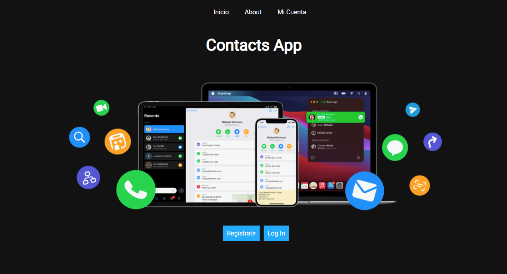
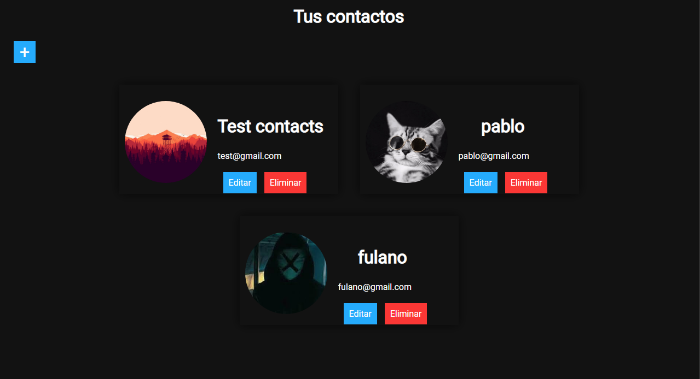

# Contacts-app
una sencilla aplicacion web donde puedes crear una cuenta y añadir contactos, editarlos, eliminarlos etc...
tencnologias usadas: express, mysql, handlebars, multer y muchas mas

## Resultado final



## Descargar
```
git clone https://github.com/janselroa/contacts-app.git
```
## Ejecutar
```
npm install
```

```
npm run dev
```

o en yarn
```
yarn install
```

```
yarn dev
```

Despues de descargar el archivo ejecute el servidor mysql, ya sea con wampserver o xamp
ingrese a la terminal de mysql y escriba
```
source [pathproyect]\query.sql
```
